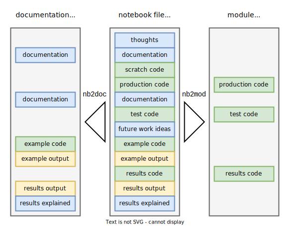

---
jupytext:
  formats: ipynb,md:myst
  text_representation:
    extension: .md
    format_name: myst
    format_version: 0.13
    jupytext_version: 1.14.0
kernelspec:
  display_name: Python 3 (ipykernel)
  language: python
  name: python3
---

```{raw-cell}
:tags: []

---
title: "Tools and utilities"
format:
  html: 
    code-fold: true
    ipynb-filters:
      - popemp/tools.py filter-docs
---
```

+++ {"tags": ["nbd-docs"]}

This notebook contains general purpose tools that are used throughout the project and might also be useful outside.

```{code-cell} ipython3
:tags: [nbd-module]

import os
import sys
import re
import inspect
import shutil
from urllib.parse import urlparse
from pathlib import Path
import io

import requests
import nbconvert
import nbformat
```

+++ {"tags": ["nbd-docs"]}

[nbd]: # "docs"
# Notebooks and Git

Jupyter notebooks are technically JSON files with possibly embedded binary data in output cells (e.g. images). This make them not very Git friendly, because most Git tools are designed to work with plain text files. Git diffs of notebooks are not very readable, merges break notebooks, and binary blobs clog storage and don't diff or merge. Multiple approaches exist to address these problems, and I recommend using the [Jupytext](https://github.com/mwouts/jupytext) tool to only version plaintext replicas of notebooks and add `.ipynb` files to `.gitignore`.

+++ {"tags": ["nbd-docs"]}

# NBD: development in the notebook

This section defines the `Nbd` class that can be used to convert a notebook into a script or a documentation page. This approach was greatly inspired by the [nbdev](https://github.com/fastai/nbdev) project and can be thought of as a reduced and simplified `nbdev`.



To use `Nbd`, create an instance with the name of your package and call methods from that instance like so: `nbd = Nbd('popemp')`.

Method `Nbd.nb2mod()` selectively exports code cells into a script, making it easily importable in other parts of the project and also leaving out scratch and exploratory code. To mark code cell for export to a module, give it a `nbd-module` tag. All imports from project modules into notebooks should take absolute form `from ... import ...`, they will be automatically converted to relative import in scripts. For example, `from popemp.tools import Nbd` will become `from .tools import Nbd`.

```{code-cell} ipython3
:tags: [nbd-module]

class Nbd:
    def __init__(self, pkg_name):
        self.pkg_name = pkg_name
        self.nbs_dir = 'nbs'
        self.root = self._locate_root_path()
        p = self.pkg_path = self.root/pkg_name
        assert p.exists() and p.is_dir()
        p = self.nbs_path = self.root/self.nbs_dir
        assert p.exists() and p.is_dir()
        self._make_symlinks()
        
    def _locate_root_path(self):
        # call stack: 0=this function, 1=__init__(), 2=caller
        caller = inspect.stack()[2].filename
        if any(x in caller for x in ['<ipython-input', 'xpython_', 'ipykernel_', '<stdin>']):
            # class initialized from interactive shell or notebook
            p0 = '.'
        else:
            # class initialized from a Python module
            p0 = caller
        p = p0 = Path(p0).resolve()
        while p != p.anchor:
            if (p/self.pkg_name).exists() and (p/self.nbs_dir).exists():
                return p
            p = p.parent
        raise Exception(f'Could not find project root above "{p0}".')
        
    def _make_symlinks(self):
        # support for nested subpackages can be added by recursing into subdirs of nbs/ and making links in them
        cur_dir = Path.cwd()
        os.chdir(self.nbs_path)
        link = Path(self.pkg_name)
        if link.exists():
            assert link.is_symlink(), f'Symbolic link expected at "{link.absolute()}".'
        else:
            to = Path(f'../{self.pkg_name}')
            link.symlink_to(to, target_is_directory=True)
            link = link.absolute().relative_to(self.root)
            to = to.resolve().relative_to(self.root)
            print(f'Creating symbolic link "{link}" -> "{to}"')
            
        os.chdir(cur_dir)

    def nb2mod(self, nb_rel_path):
        """`nb_rel_path` is relative to project's notebook directory."""
        nb_rel_path = Path(nb_rel_path)
        nb_path = self.nbs_path/nb_rel_path
        assert nb_path.exists() and nb_path.is_file(), f'Notebook not found at "{nb_path}".'
        nb = nbformat.read(nb_path, nbformat.current_nbformat)
        
        # only keep cells with "nbd-module" tag
        nb.cells = [c for c in nb.cells 
                    if ('tags' in c.metadata) and ('nbd-module' in c.metadata.tags)]
        
        exporter = nbconvert.exporters.PythonExporter(exclude_input_prompt=True)
        script, _ = exporter.from_notebook_node(nb)
        mod_path = self.pkg_path/nb_rel_path.with_suffix('.py')
        
        # convert abs to rel imports
        script = '\n'.join(self._relative_import(l, mod_path.relative_to(self.root))
                           for l in script.split('\n'))
        
        mod_path.parent.mkdir(parents=True, exist_ok=True)
        mod_path.write_text(script)
        
        src = nb_path.relative_to(self.root)
        dst = mod_path.relative_to(self.root)
        print(f'Converted notebook "{src}" to module "{dst}".')
        
    def _relative_import(self, line, file_rel_path):
        """Replace line like "from pkg.subpkg.mod1 import obj" in file "pkg/subpkg/mod2.py"
        with "from .mod1 import obj"
        """
        pattern = r'^(\s*)from \s*(\S+)\s* import (.*)$'
        m = re.match(pattern, line)
        if not m: 
            return line
        indent, mod, obj = m.groups()
        if not mod.startswith(self.pkg_name):
            return line
        # mod is like "pkg.subpkg.mod1", mod_path is like "pkg/subpkg/mod2.py"
        # need to replace each part of common prefix with a dot
        mod_parts = mod.split('.')
        path_parts = list(Path(file_rel_path).parts)
        common_len = 0
        while ((common_len < len(mod_parts))
               and (common_len < len(path_parts))
               and (mod_parts[common_len] == path_parts[common_len])):
            common_len += 1
        dots = '.' * (len(path_parts) - common_len)
        rel_mod = dots + '.'.join(mod_parts[common_len:])
        return f'{indent}from {rel_mod} import {obj}'
```

+++ {"tags": ["nbd-docs"]}

Example and testing of `Nbd` root dir finder.

```{code-cell} ipython3
:tags: [nbd-docs]

nbd = Nbd('popemp')
print(f'Project root directory: "{nbd.root}"')
```

+++ {"tags": ["nbd-docs"]}

# Documentation

Static HTML documentation website is built from notebooks using [Quarto](https://quarto.org/).
`filter_docs()` function is used to only select cells with `nbd-docs` tag.

```{code-cell} ipython3
:tags: [nbd-module]

def filter_docs():
    """Only keep cells with "nbd-docs" tag."""
    nb = nbformat.reads(sys.stdin.read(), as_version=nbformat.NO_CONVERT)
    nb.cells = [
        c for c in nb.cells
        if ('tags' in c.metadata) and ('nbd-docs' in c.metadata.tags)
    ]
    nbformat.write(nb, sys.stdout)
```

+++ {"tags": ["nbd-docs"]}

# Misc

`download_file()` takes URL, downloads file to specified location and returns it's path. Subsequent calls to the same function return cached copy from disk. We use this function to automate manual operations, to simplify replication and to allow pulling data into our cloud-hosted dashboard.

```{code-cell} ipython3
:tags: [nbd-module]

def download_file(url, dir=None, fname=None, overwrite=False, verbose=True):
    """Download file from given `url` and put it into `dir`.
    Current working directory is used as default. Missing directories are created.
    File name from `url` is used as default.
    Return absolute pathlib.Path of the downloaded file.
    """
    
    if dir is None:
        dir = '.'
    dpath = Path(dir).resolve()
    dpath.mkdir(parents=True, exist_ok=True)

    if fname is None:
        fname = Path(urlparse(url).path).name
    fpath = dpath / fname
    
    if not overwrite and fpath.exists():
        print(f'File {fname} already exists.')
        return fpath

    with requests.get(url, stream=True) as r:
        r.raise_for_status()
        with open(fpath, 'wb') as f:
            for chunk in r.iter_content(chunk_size=2**20):
                f.write(chunk)
    
    if verbose: print(f'Download complete: {fname}.')
    return fpath
```

+++ {"tags": ["nbd-docs"]}

Example: download LICENSE file from GitHub repo and assert that it's contents is the same as in the local repo version.

```{code-cell} ipython3
:tags: [nbd-docs]

nbd = Nbd('popemp')
f = download_file('https://raw.githubusercontent.com/antonbabkin/workshop-notebooks/main/LICENSE', nbd.root, 'LICENSE_COPY')
assert open(nbd.root/'LICENSE').read() == open(f).read()
f.unlink()
```

+++ {"tags": ["nbd-docs"]}

# CLI interface

If `tools.py` is execuded directly as a module with `filter-docs` argument, it will apply the documentation filter. This is used for `ipynb-filters` option of Quarto renderer.

```{code-cell} ipython3
:tags: [nbd-module]

if __name__ == '__main__':
    if sys.argv[1] == 'filter-docs':
        filter_docs()
```

+++ {"tags": ["nbd-docs"]}

# Build this module
This notebook itself is turned into importable module by running the code below.

```{code-cell} ipython3
:tags: [nbd-docs]

nbd = Nbd('popemp')
nbd.nb2mod('tools.ipynb')
```
